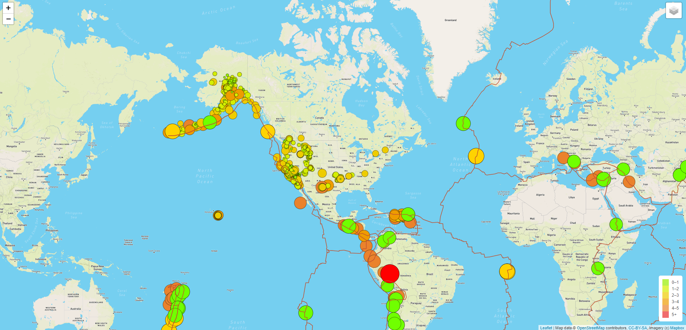

# Mapping_Earthquakes Summary

## Overview
During this module we put together a visual of earthquakes that have been reported in the last seven days. We used the following resources in this module's challenge to achieve the end goal. 

* GeoJSON
* Javascript
* Leaflet
* HTML

## Visual Outputs
